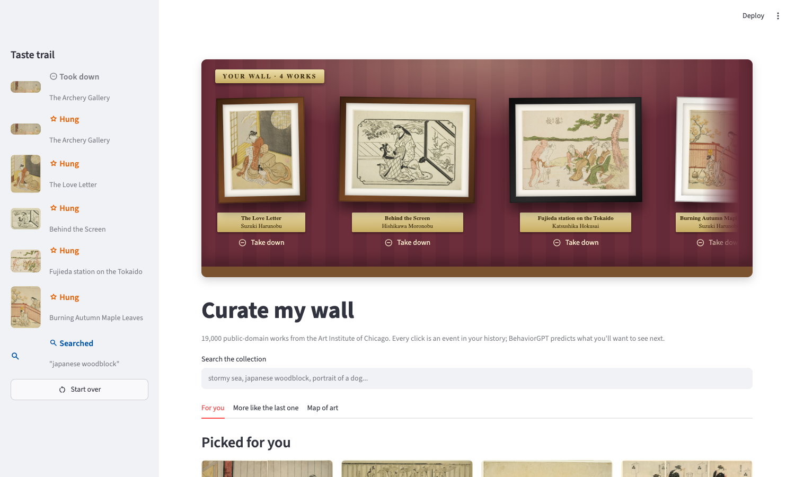
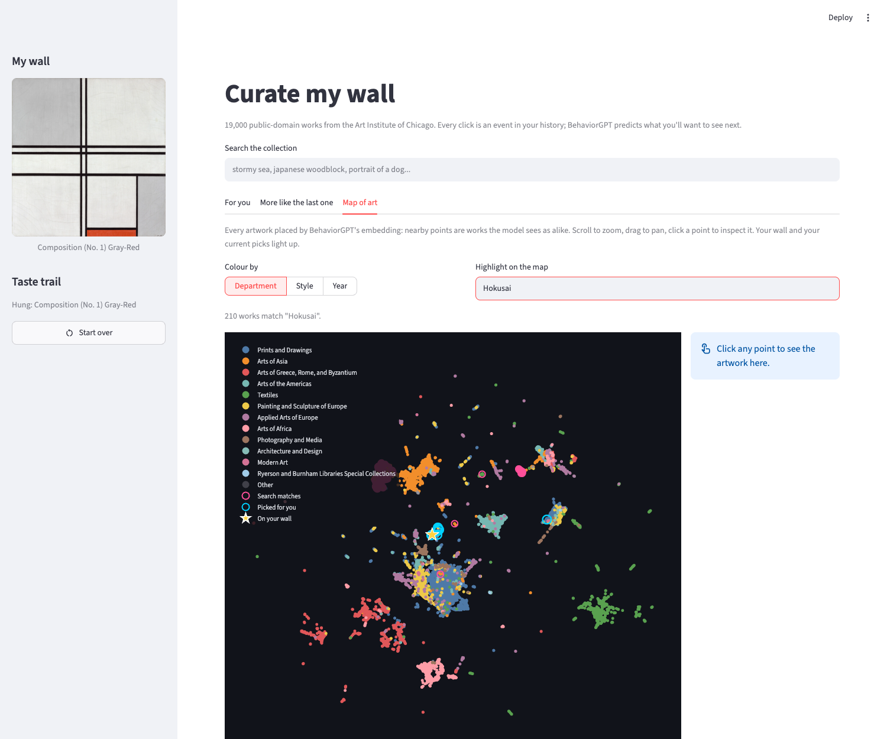
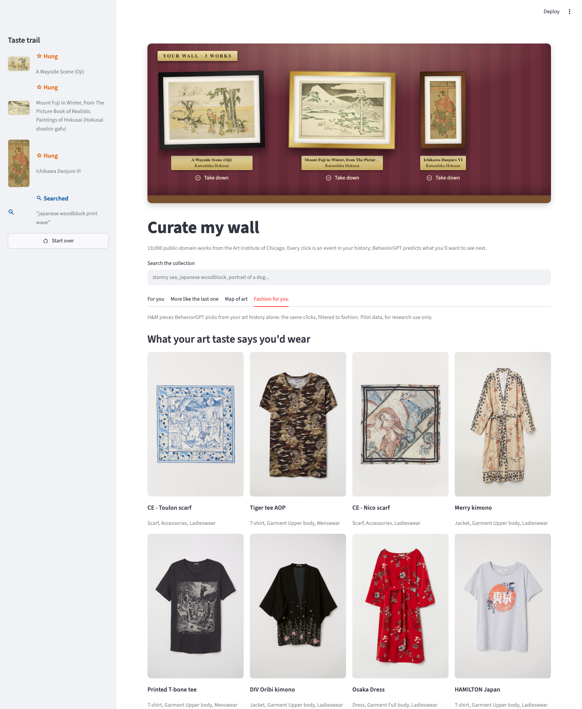

# Curate my wall

Browse 19,000 public-domain artworks from the [Art Institute of Chicago](https://www.artic.edu/open-access) with [BehaviorGPT](https://github.com/Unbox-AI/behaviorgpt) as the curator. Every click is an event in your history: look closer at a work, hang it on your wall, take it down, search. BehaviorGPT predicts what you want to see next, and the map shows where your taste sits in the model's view of art. A "Fashion for you" tab then turns the same art clicks into clothing recommendations.

**[Try it live at aic-artworks.streamlit.app](https://aic-artworks.streamlit.app/)**



It is a small, complete example of building on the BehaviorGPT SDK: turning an open dataset into a catalog, embedding it, and driving recommendations, personalized search, similar items and the embedding map from a user's clicks.

> Status: working prototype. See [FIXES.md](FIXES.md) for what needs fixing before a public launch.

## What it shows

| In the app | BehaviorGPT call |
|---|---|
| "For you" grid, cold start and after every click | `client.complete(history=[...])` |
| Search box, ranked by your history | `complete` with a `Search` as the last event |
| Look closer / Hang it / Take down | `View`, `AddToCart`, `RemoveFromCart` events |
| "More like the last one" | `client.similar_items(id)` |
| Map of art | `client.umap()`, redrawn with Plotly |
| "Fashion for you", from art clicks only | `complete` on a mixed art + fashion catalog, with `filters` |
| Uploading the collection | `client.embed(parquet)` |



## Run it

Needs Python 3.11+, [uv](https://github.com/astral-sh/uv) and a BehaviorGPT API key from [unboxai.com/behaviorgpt](https://unboxai.com/behaviorgpt).

```sh
git clone https://github.com/Unbox-AI/aic-artworks.git
cd aic-artworks
uv sync
cp .env.example .env                # paste your key as UNBOXAI_API_KEY

uv run python app/build_catalog.py  # fetch artworks from the museum API (~15 min, once)
uv run python app/embed.py          # upload and embed the catalog (~2 min)
uv run streamlit run app/app.py
```

`.env.example` points `ART_IMAGE_BASE_URL` at images that are already hosted, so you do not need to download or upload any images. The embedded catalog is private to your API key.

## How it was built

1. **Fetch the collection.** [`build_catalog.py`](app/build_catalog.py) pages through the museum's search API for public-domain works with an image. The API refuses more than 1,000 results per query, so the script splits the date range until each slice fits, and stays under the anonymous limit of 60 requests a minute.
2. **Map it to the catalog format.** Each artwork becomes one row in [BehaviorGPT's catalog format](https://github.com/Unbox-AI/behaviorgpt/blob/main/docs/catalog-format.md): title as `name`, artist as `brand`, department, medium and style as `categories`, subject and style tags as `keywords`. The museum's own "boosted" and "viewed" flags stand in for popularity, since there are no sales numbers. The 19,000 best-known works are kept; a catalog holds at most 20,000.
3. **Host the images.** The museum's Cloudflare blocks requests from datacenters, so BehaviorGPT's servers get a 403 for every image even though a browser can load them. The works are CC0, so [`fetch_images.py`](app/fetch_images.py) downloads them from a normal connection, shrinks them to 512 px, and [`upload_images.py`](app/upload_images.py) publishes them as a [Hugging Face dataset](https://huggingface.co/datasets/unboxai/aic-artworks). Only the museum's 843 px renditions are reliably cached; other sizes time out.
4. **Embed.** [`embed.py`](app/embed.py) uploads the parquet, saves the catalog id straight away, and waits out network hiccups and the one-ingest-at-a-time lock. Test with a few hundred rows first: a job only reports "failed", without a reason.
5. **Turn clicks into history.** [`app.py`](app/app.py) keeps the session's events and replays them to `complete` on every click, so each action re-ranks the grid. [`art_map.py`](app/art_map.py) takes the point coordinates out of the `umap` page, caches them, and redraws them so the map can be recoloured by department, style or year, searched, and clicked.

## Layout

```
app/
  app.py            Streamlit app
  art_map.py        embedding map: coordinates from client.umap(), Plotly figure
  build_catalog.py  museum API -> data/artworks.jsonl -> data/art_catalog.parquet
  fetch_images.py   download and shrink images for re-hosting
  upload_images.py  publish images as a public Hugging Face dataset
  embed.py          upload the catalog and wait for it to be ready
  publish_data.py   upload the app's runtime data to the dataset, for deployments
  download_data.py  fetch that data on a host that starts without it
  build_mixed.py    fashion pilot: art + H&M in one catalog
  probe_mixed.py    fashion pilot: replay art personas, measure the fashion picks
  data/             everything fetched or built (git-ignored)
```

To re-host the images yourself, add a Hugging Face write token to `.env` as `HF_TOKEN`, then run `fetch_images.py`, `upload_images.py <user>/<repo>`, and point `ART_IMAGE_BASE_URL` at the URL it prints.

## Deploy

The app runs on [Streamlit Community Cloud](https://share.streamlit.io) straight from this repo: entrypoint `app/app.py`, Python 3.11, dependencies from `uv.lock`. It starts without any data and fetches the catalog, map fields and cached map from `app-data/` in the [unboxai/aic-artworks](https://huggingface.co/datasets/unboxai/aic-artworks) dataset. Paste two secrets into the app's settings:

```toml
UNBOXAI_API_KEY = "..."
ART_CATALOG_ID = "cat_..."  # a catalog embedded with that key
APP_PASSWORD = "..."        # optional: visitors must enter it first
DAILY_CALL_LIMIT = "3000"   # optional: API calls per day across all visitors
SESSION_CLICK_LIMIT = "150" # optional: clicks per visitor session
```

The daily count lives in the app's process, so it resets when the app restarts; the API key's own limits on UnboxAI's side are the hard stop.

After re-embedding, run `uv run python app/publish_data.py unboxai/aic-artworks` (open the map once first so its coordinates are cached) and update `ART_CATALOG_ID`. [`space/`](space/) holds a Dockerfile and deploy script for a Hugging Face Space, which needs a paid Hugging Face plan.

To show the [fashion pilot](#fashion-pilot) in the deployed app, publish the mixed catalog to a private dataset with `uv run python app/publish_data.py bruel/aic-artworks-fashion mixed_bridged_large` and add the secrets `ART_CATALOG_STATE = "mixed_bridged_large.json"`, `ART_CATALOG_ID` set to the mixed catalog's id, and `HF_TOKEN` set to a read-only token for that dataset. The H&M data is licensed for research only, so the dataset must stay private.

## Fashion pilot

Does your taste in art say anything about what you'd wear? The pilot embeds artworks and H&M products in one catalog, keeps the art grids art-only with a `filters` query on `id`, and adds a "Fashion for you" tab driven by the same art clicks.



```sh
# articles.csv from Kaggle's H&M Personalized Fashion Recommendations, in data/fashion/
uv run python app/build_mixed.py 19000 19000 large
uv run python app/embed.py data/mixed_bridged_large.parquet data/mixed_bridged_large.json
uv run python app/probe_mixed.py data/mixed_bridged_large.parquet data/mixed_bridged_large.json
ART_CATALOG_STATE=mixed_bridged_large.json uv run streamlit run app/app.py
```

`build_mixed.py` writes a `plain` catalog and a `bridged` one that also tags both sides with a shared colour and motif vocabulary. On 19,000 + 19,000 items, different art histories get clearly different fashion (kimonos for Japanese prints, beaded bracelets for ancient Egypt, statement earrings for portraits), but the two domains never mix in the embedding, and colour barely carries over.

The H&M data is licensed by Kaggle for non-commercial research only and may not be redistributed. The live demo shows the pilot for research, and reads the mixed catalog from a private dataset rather than publishing it.

## Data and license

Artwork data and images are from the Art Institute of Chicago's [open access](https://www.artic.edu/open-access) collection, released under CC0. The code is MIT licensed.
